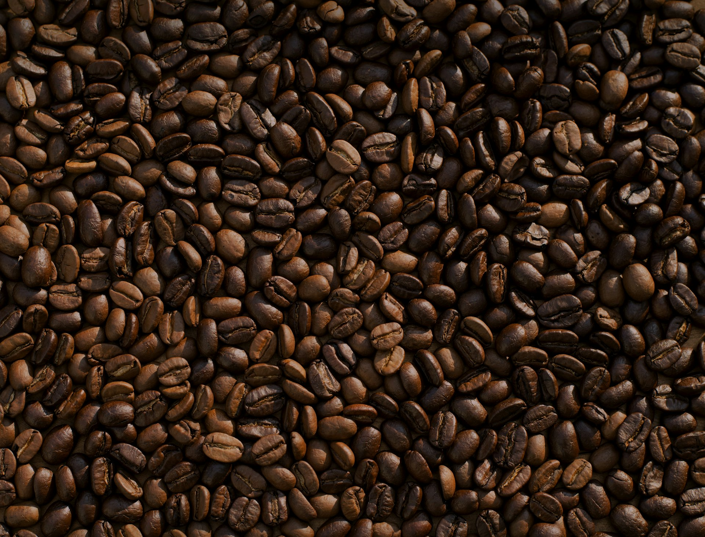
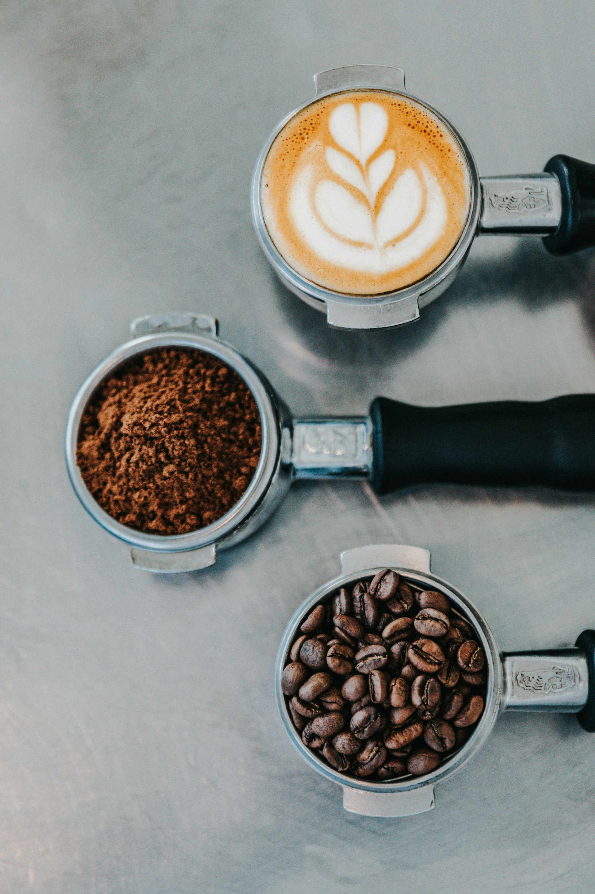

<!-- _class: title -->

# Cold Brew, Hot Takes

## _my usual approach is useless here_

<!--
Salut ! Aujourd'hui on parle café. Mais aussi chaos, science, alchimie, et pourquoi vous boirez plus jamais deux fois le même espresso.

D'ailleurs — pendant qu'on cause, je vais préparer deux cafés. Mêmes grains, deux méthodes. On goûte à la fin.

BREW CUE: Rincer le filtre V60, montrer les grains, les sentir. Setup visible pour tout le monde.
-->

---

<!-- _class: quote bg-dim -->

# "Chérie, il y a un café là-bas"

<!--
J'ai commencé le café pour une raison très noble : ma copine avait souvent besoin de toilettes quand on se baladait en vacances. Du coup on s'arrêtait dans des cafés. Beaucoup de cafés.

Et une fois sur cinq... c'était pas juste un shot de caféine. C'était bon. Genre, vraiment bon.

Et là j'ai voulu comprendre. Pourquoi celui-ci et pas celui-là ?

BREW CUE: V60 bloom — verser un peu d'eau, laisser gonfler. "Vous voyez ça ? Ça s'appelle le bloom. Les grains frais dégagent du CO2. Déjà là, y'a de la chimie."
-->

---

<!-- _class: center -->

# "So... you work in the industry?"

<!--
Retour au même shop — cette fois, pas pareil. Acheté les grains, à la maison, pas pareil non plus. Lu le manuel de la machine espresso, enfin de la crema ! Puis le filter. Plus je goûte, plus y'a de palette. Plus je pose de questions dans les shops...

"So you work in the industry?" Euh... non ? Mais je suis industrieux vis-à-vis du café, ça compte ?

T+3 ans, je suis là devant vous. Envoyez de l'aide.

BREW CUE: V60 premier pour. Geste lent, circulaire. Laisser passer.
-->

---

<!-- _class: avalanche -->

### Les variables

Cépage

<!--
J'ai voulu tout comprendre.
-->

---

<!-- _class: avalanche -->

### Les variables

Cépage · Terroir

---

<!-- _class: avalanche -->

### Les variables

Cépage · Terroir · Altitude

---

<!-- _class: avalanche -->

### Les variables

Cépage · Terroir · Altitude · Co-culture

---

<!-- _class: avalanche -->

### Les variables

Cépage · Terroir · Altitude · Co-culture · Climat

<!--
Et plus je comprends, plus je réalise que c'est fractal.
-->

---

<!-- _class: avalanche -->

### Les variables

Cépage · Terroir · Altitude · Co-culture · Climat
Récolte

---

<!-- _class: avalanche -->

### Les variables

Cépage · Terroir · Altitude · Co-culture · Climat
Récolte · Tri

---

<!-- _class: avalanche -->

### Les variables

Cépage · Terroir · Altitude · Co-culture · Climat
Récolte · Tri · Séchage (lavé? naturel? honey?)

---

<!-- _class: avalanche -->

### Les variables

Cépage · Terroir · Altitude · Co-culture · Climat
Récolte · Tri · Séchage (lavé? naturel? honey?)
Torréfaction (light? medium? dark? quel profil?)

---

<!-- _class: avalanche -->

### Les variables

Cépage · Terroir · Altitude · Co-culture · Climat
Récolte · Tri · Séchage (lavé? naturel? honey?)
Torréfaction (light? medium? dark? quel profil?)
Repos post-torréfaction

---

<!-- _class: avalanche -->

### Les variables

Cépage · Terroir · Altitude · Co-culture · Climat
Récolte · Tri · Séchage (lavé? naturel? honey?)
Torréfaction (light? medium? dark? quel profil?)
Repos post-torréfaction
Fraîcheur

---

<!-- _class: avalanche -->

### Les variables

Cépage · Terroir · Altitude · Co-culture · Climat
Récolte · Tri · Séchage (lavé? naturel? honey?)
Torréfaction (light? medium? dark? quel profil?)
Repos post-torréfaction
Fraîcheur
Mouture (taille? distribution? fines?)

---

<!-- _class: avalanche -->

### Les variables

Cépage · Terroir · Altitude · Co-culture · Climat
Récolte · Tri · Séchage (lavé? naturel? honey?)
Torréfaction (light? medium? dark? quel profil?)
Repos post-torréfaction
Fraîcheur
Mouture (taille? distribution? fines?)
Eau (minéralité? pH? température?)

<!--
BREW CUE: V60 — deuxième pour. "Vous voyez, là je fais des gestes 'précis'. Mais ma main tremble un peu parce que je parle en même temps. Variable."
-->

---

<!-- _class: avalanche -->

### Les variables

Cépage · Terroir · Altitude · Co-culture · Climat
Récolte · Tri · Séchage (lavé? naturel? honey?)
Torréfaction (light? medium? dark? quel profil?)
Repos post-torréfaction
Fraîcheur
Mouture (taille? distribution? fines?)
Eau (minéralité? pH? température?)
Ratio

---

<!-- _class: avalanche -->

### Les variables

Cépage · Terroir · Altitude · Co-culture · Climat
Récolte · Tri · Séchage (lavé? naturel? honey?)
Torréfaction (light? medium? dark? quel profil?)
Repos post-torréfaction
Fraîcheur
Mouture (taille? distribution? fines?)
Eau (minéralité? pH? température?)
Ratio · Temps de contact

---

<!-- _class: avalanche -->

### Les variables

Cépage · Terroir · Altitude · Co-culture · Climat
Récolte · Tri · Séchage (lavé? naturel? honey?)
Torréfaction (light? medium? dark? quel profil?)
Repos post-torréfaction
Fraîcheur
Mouture (taille? distribution? fines?)
Eau (minéralité? pH? température?)
Ratio · Temps de contact · Pression

---

<!-- _class: avalanche -->

### Les variables

Cépage · Terroir · Altitude · Co-culture · Climat
Récolte · Tri · Séchage (lavé? naturel? honey?)
Torréfaction (light? medium? dark? quel profil?)
Repos post-torréfaction
Fraîcheur
Mouture (taille? distribution? fines?)
Eau (minéralité? pH? température?)
Ratio · Temps de contact · Pression
Méthode (espresso? V60? Aeropress? Moka? Chemex?)

---

<!-- _class: avalanche -->

### Les variables

Cépage · Terroir · Altitude · Co-culture · Climat
Récolte · Tri · Séchage (lavé? naturel? honey?)
Torréfaction (light? medium? dark? quel profil?)
Repos post-torréfaction
Fraîcheur
Mouture (taille? distribution? fines?)
Eau (minéralité? pH? température?)
Ratio · Temps de contact · Pression
Méthode (espresso? V60? Aeropress? Moka? Chemex?)
Technique de pouring

---

<!-- _class: avalanche -->

### Les variables

Cépage · Terroir · Altitude · Co-culture · Climat
Récolte · Tri · Séchage (lavé? naturel? honey?)
Torréfaction (light? medium? dark? quel profil?)
Repos post-torréfaction
Fraîcheur
Mouture (taille? distribution? fines?)
Eau (minéralité? pH? température?)
Ratio · Temps de contact · Pression
Méthode (espresso? V60? Aeropress? Moka? Chemex?)
Technique de pouring · Nombre de pours

---

<!-- _class: avalanche -->

### Les variables

Cépage · Terroir · Altitude · Co-culture · Climat
Récolte · Tri · Séchage (lavé? naturel? honey?)
Torréfaction (light? medium? dark? quel profil?)
Repos post-torréfaction
Fraîcheur
Mouture (taille? distribution? fines?)
Eau (minéralité? pH? température?)
Ratio · Temps de contact · Pression
Méthode (espresso? V60? Aeropress? Moka? Chemex?)
Technique de pouring · Nombre de pours · Timing

---

<!-- _class: avalanche -->

### Les variables

Cépage · Terroir · Altitude · Co-culture · Climat
Récolte · Tri · Séchage (lavé? naturel? honey?)
Torréfaction (light? medium? dark? quel profil?)
Repos post-torréfaction
Fraîcheur
Mouture (taille? distribution? fines?)
Eau (minéralité? pH? température?)
Ratio · Temps de contact · Pression
Méthode (espresso? V60? Aeropress? Moka? Chemex?)
Technique de pouring · Nombre de pours · Timing
...

<!--
Chaque variable cache dix sous-variables. L'altitude change la densité du grain qui change la torréfaction optimale qui change la mouture idéale qui...

BREW CUE: V60 — troisième pour. "Variable."
-->

---

<!-- _class: avalanche -->

### Les variables

Cépage · Terroir · Altitude · Co-culture · Climat
Récolte · Tri · Séchage (lavé? naturel? honey?)
Torréfaction (light? medium? dark? quel profil?)
Repos post-torréfaction
Fraîcheur
Mouture (taille? distribution? fines?)
Eau (minéralité? pH? température?)
Ratio · Temps de contact · Pression
Méthode (espresso? V60? Aeropress? Moka? Chemex?)
Technique de pouring · Nombre de pours · Timing
...
**...TOI** (ton palais, ton humeur, ton repas d'avant, ta fatigue)

<!--
Et tout en bas de la liste — la variable qu'on oublie toujours — toi. Ton palais du mardi c'est pas ton palais du lundi. T'as mangé quoi avant ? T'as bien dormi ? T'es stressé ? On croit tous qu'on est plus objectif que la moyenne de nos amis. Spoiler : non.
-->

---

<!-- _class: center bg-dim -->

# Science vs Alchimie

<!--
La science, c'est isoler les variables. Changer UNE chose, mesurer le résultat. En théorie, parfait.

En pratique ? Tu changes la mouture ET il fait 3 degrés de plus dans ta cuisine ET t'as mangé un croissant avant ET les grains ont un jour de plus. Bonne chance pour isoler quoi que ce soit.

BREW CUE: Lancer l'Aeropress. Verser l'eau, commencer à attendre. "Là je fais une Aeropress inversée. Mêmes grains que le V60. Même eau. On verra."
-->

---

<!-- _class: center bg-dim -->

# Science vs Alchimie

## _"La moitié de mes pour-over steps sont inutiles."_

<!--
L'alchimie, c'est quoi ? C'est la science crossover la magie. C'est croire savoir, mais en vrai c'est savoir croire.
-->

---

<!-- _class: center bg-dim -->

# Science vs Alchimie

## _"La moitié de mes pour-over steps sont inutiles. Le problème, c'est que je sais pas laquelle."_

<!--
C'est le CMO qui dit à son pote : "je sais qu'une moitié de mon budget pub sert à rien, le problème c'est que je sais pas laquelle."

Les meilleurs baristas que j'ai vus font les DEUX. Heuristiques solides ET ils acceptent le mystère. C'est pas de l'ignorance. C'est de l'humilité épistémique.
-->

---

<!-- _class: heuristics -->

### L'ordre dans le chaos (un peu)

*Quelques heuristiques qui marchent (pour moi) (aujourd'hui) (peut-être)*

<!--
Mais c'est pas parce que c'est chaotique qu'on peut rien dire. On n'a pas un modèle complet, mais on a des heuristiques.
-->

---

<!-- _class: heuristics -->

### L'ordre dans le chaos (un peu)

*Quelques heuristiques qui marchent (pour moi) (aujourd'hui) (peut-être)*

Grains frais (< 4 semaines post-torréfaction)

<!--
Les miennes : grains frais...
-->

---

<!-- _class: heuristics -->

### L'ordre dans le chaos (un peu)

*Quelques heuristiques qui marchent (pour moi) (aujourd'hui) (peut-être)*

Grains frais (< 4 semaines post-torréfaction)
Fraîchement moulu > pré-moulu

---

<!-- _class: heuristics -->

### L'ordre dans le chaos (un peu)

*Quelques heuristiques qui marchent (pour moi) (aujourd'hui) (peut-être)*

Grains frais (< 4 semaines post-torréfaction)
Fraîchement moulu > pré-moulu
Light/medium > dark (pour moi !)

---

<!-- _class: heuristics -->

### L'ordre dans le chaos (un peu)

*Quelques heuristiques qui marchent (pour moi) (aujourd'hui) (peut-être)*

Grains frais (< 4 semaines post-torréfaction)
Fraîchement moulu > pré-moulu
Light/medium > dark (pour moi !)
Eau pas bouillante (si 98° → matcha)

<!--
Et si ton percolateur est réglé à 98 degrés, je prendrai un matcha, merci.
-->

---

<!-- _class: heuristics -->

### L'ordre dans le chaos (un peu)

*Quelques heuristiques qui marchent (pour moi) (aujourd'hui) (peut-être)*

Grains frais (< 4 semaines post-torréfaction)
Fraîchement moulu > pré-moulu
Light/medium > dark (pour moi !)
Eau pas bouillante (si 98° → matcha)
Le reste ? ¯\\\_(ツ)\_/¯

<!--
Le reste ? Honnêtement, c'est du feeling. Et le feeling change.

BREW CUE: Aeropress — presser lentement. "Vous entendez ce sifflement ? Normalement c'est signe que c'est bon. Normalement."
-->

---

<!-- _class: center bg-dim -->

# Do you care how the sausage is made?

<!--
MUSIC CUE: Lancer le track ici. Volume bas, ambiance. Le track joue jusqu'à la fin.

La semaine dernière à Sydney, dans un coffee shop. "What's in your cold brew?" — "Everything. Lol."

Le cold brew c'est là où les grains vont mourir. T'as des vieux trucs, des fins de sac, tu fous tout dedans, extraction longue à froid, et... parfois c'est délicieux ?

J'ai fait un cold brew chez moi avec des grains que j'aurais dû jeter. Résultat : incroyable.
-->

---

<!-- _class: minimal -->

# Cette musique, là, maintenant.

<!--
Ce morceau que vous écoutez là. Il est très probablement généré par une IA. Ou pas. J'en sais rien en fait. Mais il sonne bien, non ?
-->

---

<!-- _class: minimal -->

# Cette musique, là, maintenant.

## *GenAI slop ? Does it _matter_ ?*

<!--
Est-ce que ça change quelque chose de pas savoir ? Est-ce que vous l'appréciez moins maintenant que j'ai semé le doute ?

Laisser le track jouer quelques secondes. Rien dire. Laisser la question infuser (lol).
-->

---

<!-- _class: center -->

# BTW, l'IA...

<!--
Petit aside pour ceux qui bossent avec des LLMs ou qui parlent à des IAs. C'est exactement le même chaos. Personne sait vraiment ce qu'il y a dedans. Mes poèmes et mon code sont quelque part là-dedans, comme de vieux grains dans un cold brew. Et pourtant ça sort parfois un truc beau. Parfois non.

Même prompt, résultat différent. Même modèle, vibe différente. Vous contrôlez pas tout. Vous comprenez pas tout.
-->

---

<!-- _class: center -->

# BTW, l'IA...

## *Welcome to the club.*

<!--
Bienvenue au club.

Embrace the chaos. But not them. Les AI girlfriends c'est pas mon sujet — mais sachez que les fiancées qui tolèrent votre obsession café, c'est mieux.

Rire. Transition douce vers la dégustation.
-->

---

<!-- _class: center -->

### Moment de vérité

# V60 / Aeropress

<!--
BREW CUE: Distribuer les tasses.
-->

---

<!-- _class: center -->

### Moment de vérité

# V60 / Aeropress

*Mêmes grains. Même eau. Même moi.*

<!--
Mêmes grains. Même eau. Même moi qui les a faits. Mais pas le même résultat.

Lequel est meilleur ? Goûtez. Discutez entre vous.

...Vous êtes pas d'accord ? Bah évidemment que vous êtes pas d'accord. Parce que la dernière variable, c'est vous.

MUSIC: Le track monte vers le climax (4:18). Laisser le silence arriver naturellement avec le fade (4:26).
-->

---

<!-- _class: closer bg-dim -->

# On ne boit jamais deux fois le même café.

<!--
(Après le fade du track. Voix posée.)

On ne boit jamais deux fois le même café. Mêmes grains, mêmes gestes, même tasse — c'est différent. Et c'est pas un bug. C'est le feature.

La science nous file des heuristiques. L'alchimie nous file la permission de pas tout comprendre. Et le café du mardi sera toujours un peu différent de celui du lundi.
-->

---

<!-- _class: closer bg-dim -->

# On ne boit jamais deux fois le même café.

## *Vivement le prochain.*

<!--
Vivement le prochain.

Merci.

Clap. Sourire. Questions.
-->
